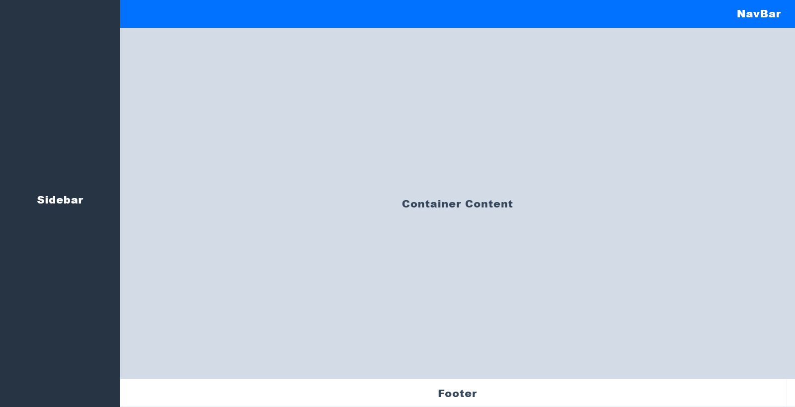
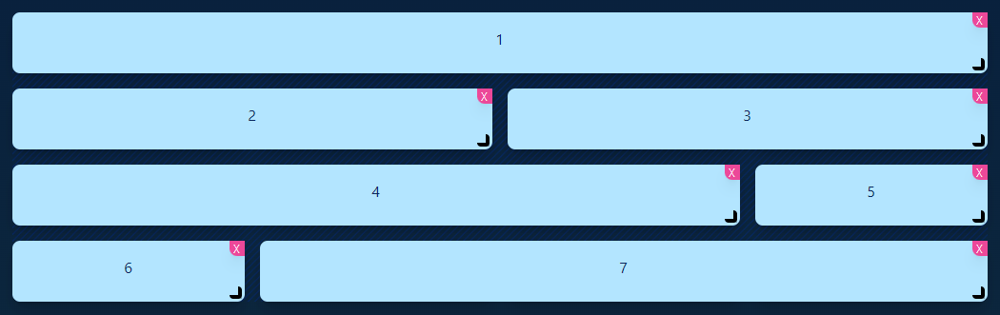
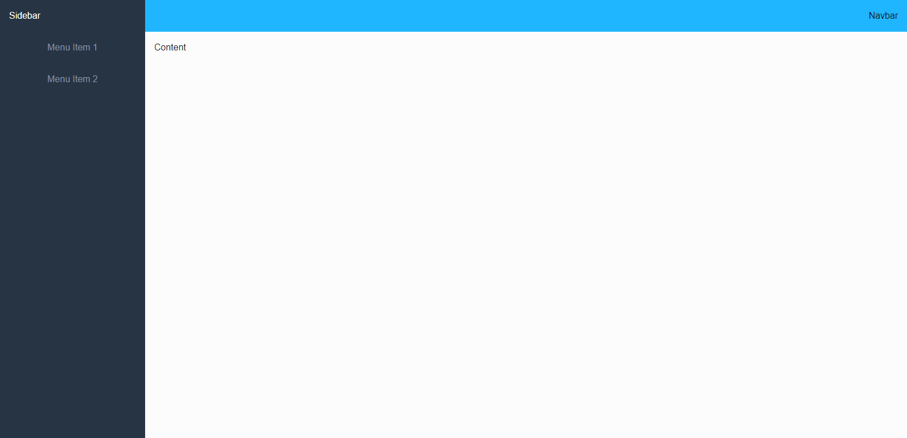
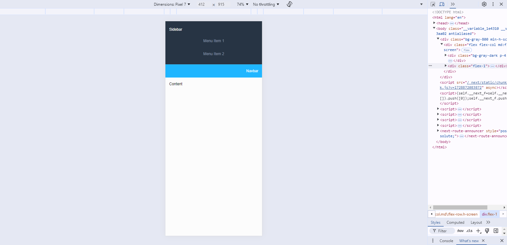
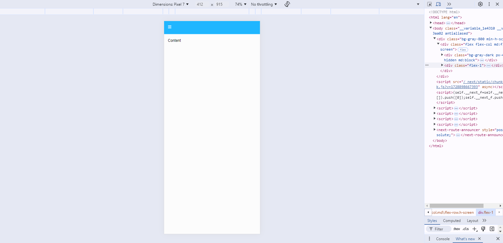

# layout



- อ่านข้อมูล [Tailwind Grid](https://tailwindcss.com/docs/grid-template-columns)

Code ดั้งเดิม

```JavaScript
import type { Metadata } from "next";
import localFont from "next/font/local";
import "./globals.css";

const geistSans = localFont({
    src: "./fonts/GeistVF.woff",
    variable: "--font-geist-sans",
    weight: "100 900",
});
const geistMono = localFont({
    src: "./fonts/GeistMonoVF.woff",
    variable: "--font-geist-mono",
    weight: "100 900",
});

export const metadata: Metadata = {
    title: "Create Next App",
    description: "Generated by create next app",
};

export default function RootLayout({
    children,
}: Readonly<{
    children: React.ReactNode;
}>) {
    return (
        <html lang="en">
            <body className={`${geistSans.variable} ${geistMono.variable} antialiased`}>
                {children}
            </body>
        </html>
    );
}
```

## Grid Example



```JavaScript
<div className="grid grid-cols-4 grid-rows-5 gap-4">

    <div className="col-span-4">1</div>
    <div className="col-span-2 row-start-2">2</div>
    <div className="col-span-2 col-start-3 row-start-2">3</div>
    <div className="col-span-3 row-start-3">4</div>
    <div className="col-start-4 row-start-3">5</div>
    <div className="row-start-4">6</div>
    <div className="col-span-3 row-start-4">7</div>

</div>
```

**NOTE :** *https://www.tailwindgen.com/*

## Page Example Layout 1



```JavaScript
import React from 'react';

const Layout1 = () => {

    return (
        <div className="bg-gray-800 min-h-screen">
            <div className="flex flex-col md:flex-row h-screen">

                <div className="bg-gray-dark p-4 md:w-64">
                    {/* Sidebar */}
                    <h1 className="text-white py-2">Sidebar</h1>
                    <ul>
                        <li className="text-center text-gray py-4">Menu Item 1</li>
                        <li className="text-center text-gray py-4">Menu Item 2</li>
                    </ul>
                </div>

                <div className="flex-1">

                    <nav className="bg-blue p-4">
                        {/* Navbar */}
                        <h1 className='text-right text-white'>Navbar</h1>
                    </nav>

                    <main className="p-4">
                        {/* Content */}
                        <p>Content</p>
                    </main>

                </div>

            </div>

        </div>
    );
}

export default Layout1
```



## Page Example Layout 1 Upgrade

Layout แบบแยก Components

```JavaScript
import React, { useState } from 'react';
import Dsidebar from '../components/DsideBar';
import Dnavbar from '../components/DnavBar';
import Dcontent from '../components/Dcontents';

const Test = () => {

    const [isDsidebarOpen, setIsDsidebarOpen] = useState(false);
    {/* กำหนดค่า Menu */}
    const menuItems = [
        { id: 1, label: 'Menu Item 1' },
        { id: 2, label: 'Menu Item 2' },
    ];

    {/* กำหนดค่า icon hamberger menu เมื่อซ่อน Dnavbar */} 
    const toggleSidebar = () => {
        setIsDsidebarOpen(!isDsidebarOpen);
    };

    return (
        <div className="bg-gray-800 min-h-screen">
            <div className="flex flex-col md:flex-row h-screen">

                <Dsidebar menuItems={menuItems} isDsidebarOpen={isDsidebarOpen} />

                <div className="flex-1">

                    <Dnavbar onToggleSidebar={toggleSidebar} />

                    <Dcontent />

                </div>

            </div>

        </div>
    );
}

export default Test;
```


