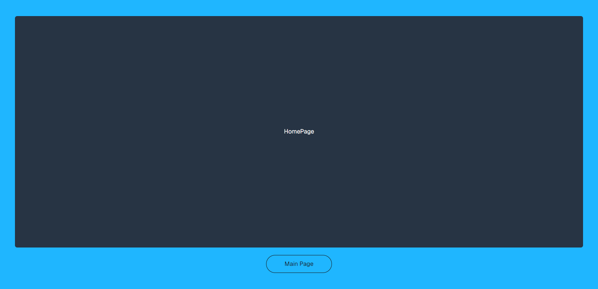
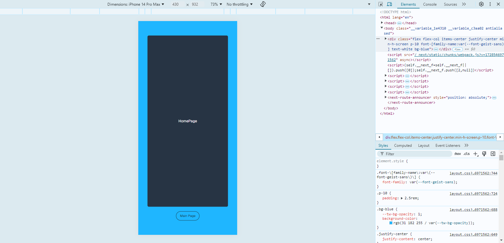

# โครงสร้าง

HomePage

- กล่องสำหรับโชว์รูปภาพ *(ยังไม่เพิ่ม Function)*
- ปุ่ม สำหรับไปยังหน้า MainPage

เมื่อคลิ๊กที่ปุ่ม Main Page แอพจะเปิดหน้า MainPage

MainPage

ใน MainPage จะให้บรรจุ Components
- NavBar : ที่ด้านบน แสดงผลเมนู fontawesome และ notification
  - ฝั่งซ้ายมือผู้ใช้
    - Logo : ปุ่มกลับไปยังหน้า MainPage เสมอ
  - ฝั่งขวามือผู้ใช้
    - icon theme : เปลี่ยน theme light/dark
    - icon github : Link ไปที่โครงการ 
    - icon profile : ไปที่หน้า Profile ผ่านระบบตรวจสอบ member *(ยังไม่เพิ่ม Function)*
- SideBar : ที่ฝั่งซ้ายมือผู้ใช้ แสดงผลเมนู Components อื่นๆ
- Container ตรงกลาง สำหรับ แสดงผลเนื้อหา Component
- Footer : ที่ด้านล่าง แสดงรายละเอียดลิขสิทธิ์

**NOTE** : *เมนูลอย สำหรับ หน้าจอ Mobile แทนที่ SideBar เมื่อใช้หน้าจอขนาดเล็ก*
